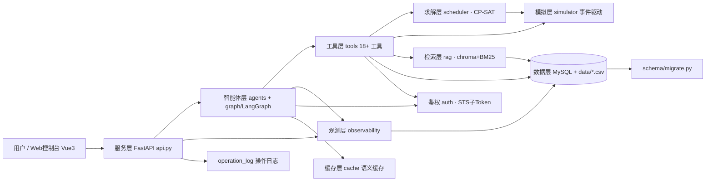
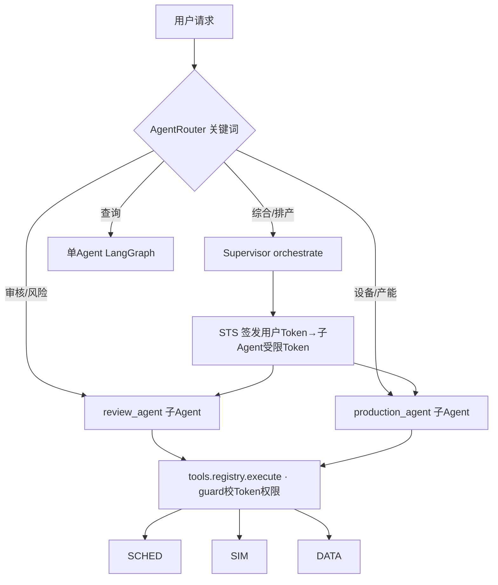

# flex-fab-agent 知识图谱（Claude 通读版）

> 生成方式：Claude Code 直接阅读源码 + docs + codegraph 索引交叉验证
> 目标：给「人 / AI」一张能顺藤摸瓜的实体-关系图
> 日期：2026-09-03 ｜ 仓库：`projects/flex-fab-agent` @ `main` 7dfa326
> 术语：KG = 知识图谱；方括号 `[A]→[B]` = A 依赖/调用 B

---

## 0. 项目是什么

制造业 3D 打印**柔性制造**的智能排产 Agent 系统：订单自动排队 → CP-SAT 约束求最优排单 → 事件驱动模拟 → 对话式 Agent 调度 → 全链路无人值守闭环。后端 Python 包 `flex_fab_agent/` + 前端 Vue3 `web/`，MySQL 数据层。

一句话分层：
`数据层 → 求解层 → 模拟层 → 智能体层 → 服务层 → 界面层`，横切：鉴权/RBAC、观测(trace+cost)、语义缓存、Prompt 版本、守卫、评估。

---

## 1. 架构层（L0 概念视图）

---

## 2. 模块实体表（K1 结构层）

| 模块 | 职责 | 关键实体 | 核心依赖 |
|---|---|---|---|
| `scheduler/` | CP-SAT 排产求解、自动排产器、产能评估 | `solver.solve()` C1-C9 约束；`AutoScheduler` 自动 tick + FIFO 审批防重入；`assessment.*` 产能/交期评估；`snapshot/verify/model` | ortools；simulator 时间；tools 查询 |
| `simulator/` | 事件驱动生产仿真 | `SimulatorRunner` 心跳线程、`engine.advance_tick/fire_events`、`events.generate_new_order/seed`、`clock`(sim_clock)、`states/constants` | scheduler(触发重排)；cache；schema |
| `agents/` | 多/单 Agent 编排 | `SupervisorAgent`(调度中心)、`router.AgentRouter`(关键词意图)、`review_agent`(风控)、`production_agent`(排产)、`single_agent`(查询) | auth.STS 子Token；tools；prompts；tracer；audit |
| `graph/` | LangGraph 会话图 | `state.AgentState`(TypedDict)、`single_agent_graph.build_*`(analyze→select_and_execute→evaluate→answer 5 节点)、`checkpointer`(sqlite 持久化)、`context_compressor` | langgraph；tools.registry；prompts |
| `tools/` | 工具注册 + 执行 | `registry.ToolRegistry/build_default_registry`(execute 带 RBAC)；`order_tools`(orders/生产状态)；`resource_tools`(库存/设备/客户)；`scheduler_tools`(run/approve/query_schedule/KPI/良率/forecast 等)；`data`(DB/CSV 存取)；`mcp_client/mcp_servers`；`sandbox` | 数据层；scheduler；simulator；rag；auth.guard |
| `rag/` | 知识库检索 | `retriever`(chroma 语义 + BM25 稀疏)、`knowledge_base`(合同/条款) | chromadb；sentence-transformers；rank-bm25；jieba |
| `core/` | 地基 | `llm_client`(Provider 主备降级 openai 协议)、`logging_setup`、`response`、`utils`、`hf_utils` | openai/httpx |
| `cache/` | 语义缓存 | `semantic_cache`(语义命中)、`llm_cache`、`manager` | chroma；embedding |
| `auth/` | 安全 | `STS token_exchange`(用户Token→子Agent受限Token)、`guard.check_tool_permission`(RBAC)、`mint`、`quota`、`audit_logger` | core；tools |
| `observability/` | 观测 | `tracer.Span/Tracer`(trace_id 两级树)、`cost`(token费用)、`operation_log`(操作日志分类落库)、`dashboard/exporter/case_collector/request_context` | cache；tools；DB |
| `guardrails/` | 护栏 | `content_filter`、`rules` | core |
| `prompts/` | Prompt 版本化 | `system_prompts`、`versioning.rollback`(可回滚+审计) | auth |
| `eval/` | 三层评估 | `runner`、`judge/judge_prompt`、`metrics`、`trajectory(_capture)`、`ragas_regression` | rag；LLM |
| `forecast/` | 预测 | `forecaster`、`models`(需求/交期预测) | tools |
| `backtest/` | 回测 | `runner`、`scenarios` | simulator/scheduler |
| `schema/` | DB 迁移 | `migrate.up/down/status`(v1-v5+ 幂等) | pymysql |
| `api.py` | FastAPI 入口 | ~25 端点：sim/schedule/scheduler/order/kpi/resources/dashboard/ask/debug/config/threads | 全部上层 |
| `main.py` | CLI 入口 | `--check/--sim/--init-schedule/--rollback/--chat/--mode multi/--demo` | 同上 |
| `config.py` | 配置 | Provider 可用性、数据源、env 双源 | core |

**依赖入度 Top（codegraph 实测）**：`tools` **74** ＞ `flex_fab_agent`(根) 49 ＞ `observability` 33 ＞ `scheduler` 24 —— `tools` 是全系统服务总线；`observability` 横切各层。

---

## 3. 关键关系边（K2 语义层）

### 3.1 Agent 编排链路

### 3.2 单 Agent LangGraph 节点（`graph/single_agent_graph.py`）
`AgentState(messages/tool_results/iteration/pending_write/…)` 贯穿：
`analyze_intent → select_and_execute(工具执行) → evaluate_results(校验+检索循环) ⇄(needs_more/needs_retry 回跳) → generate_answer`，`should_continue` 判出口，上限 5 迭代防死循环；`pending_write` 让评估识别到写意图(排产/审批)后强制补执行写工具。

### 3.3 模拟 ↔ 求解 闭环
`SimulatorRunner(_loop tick) → engine.advance_tick(推进前道/打印/完成/报废) → 触发 _need_reschedule → AutoScheduler.run_once(_auto_schedule + _fifo_approve 幂等) → solver.solve → persist(schedule_versions) → 回灌 simulator`；sim_clock 驱动，kpi_snapshot 每 tick 快照。自动推进器/模拟器均有**防重入保护**。

### 3.4 观测贯穿（每轮查询）
`main._run_with_trace / api._run_agent_round`：`new_trace_id() → tracer.reset + cost.reset → 执行 → tracer.format_text/cost → flush`；supervisor 级 span 成**两级树**(orchestrate→dispatch→tool)；审计 `AuditLogger` 记录 issue_token/exchange/dispatch/sub_call/prompt_rollback；`operation_log` 把 HTTP 请求分类(读/写)落库供前端操作日志页分页。

### 3.5 数据模型（MySQL ~26 表）
核心业务：`orders` `parts` `batches` `machines` `personnel` `inventory` `material` `customer` `preprocess_tasks` `bad_parts`；
调度仿真：`schedule_versions` `approvals` `sim_events` `sim_clock` `kpi_snapshot` `state_change_log`；
平台：`trace_record` `cost_record` `operation_log` `system_config` `llm_cache` `tokens` `schema_version`。
种子数据：`flex_fab_agent/data/*.csv`(orders/machines/inventory/customers + 合同条款 txt)。ORM-less，`tools/data.py` 直接 pymysql + CSV 双源。

---

## 4. 外部依赖（K3 生态层）

| 依赖 | 用途 |
|---|---|
| `langgraph`+checkpoint-sqlite | Agent 状态机 + 会话持久化(checkpointer) |
| `ortools` | CP-SAT 约束求解(排产) |
| `fastapi`+`uvicorn` | 服务层 |
| `openai`/`litellm` | LLM Provider 抽象，主备降级(DeepSeek/火山/Kimi) |
| `chromadb`+`sentence-transformers`+`rank-bm25`+`jieba` | 语义/稀疏混合检索 + 语义缓存 |
| `pymysql`+`DBUtils`、`redis` | MySQL 池、Redis |
| `opentelemetry-*` | 链路埋点 |
| `mcp` | 工具层可接 MCP server |
| Vue3 + ECharts + Element Plus(vue-router/axios) | web/ 控制台(11 views) |

---

## 5. 入口与边界速查

- **HTTP**：`flex_fab_agent/api.py`（/ask 主对话、/sim/* 模拟、/schedule/* 排产审批、/dashboard/*、/debug/*、/config、/logs）
- **CLI**：`python -m flex_fab_agent.main ...`（见 §0 文档）
- **前端**：`web/src/views/*.vue` 11 页，路由 `web/src/router/index.ts`，API 封装 `web/src/api/*.ts`
- **测试**：`run_all_tests.py` 全量；`smoke_test.py` S0-S11；61 个单测文件（mock LLM 零成本）

---

## 6. 已知设计约束/坑位（阅读提示）

- `tools/data.py` 数据源双轨：DB(MySQL) 与 CSV；`normalize_order_status` 统一状态口径
- `state.py` 注明：LangGraph 会**丢弃未声明 key**（pending_write 曾失效 trace 83e162c3）→ 状态字段必须在 schema 声明
- `guardrails`、`sandbox`、`quota` 为安全纵深：子 Agent 用受限子 Token，工具层 RBAC 真生效
- RAG 知识库来源=合同特殊条款 txt；历史延期记录 txt 参与交期评估(forecast)

---
*证据来源：README.md、CLAUDE.md、docs/demo/02-specs、源码 main/supervisor/router/graph/scheduler/simulator/tools/observability/api、codegraph 索引(nodes 2657/edges 7349) 交叉验证。*
